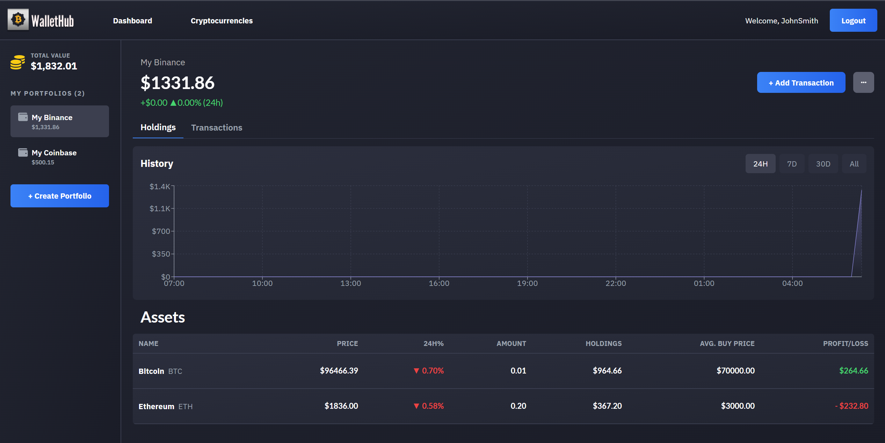

# WalletHub

**WalletHub** is an application for tracking your cryptocurrency portfolios. It allows users to manage multiple crypto assets, track transactions, and view the changes in their portfolio values over time. The app integrates with the CoinMarketCap API to provide up-to-date cryptocurrency information and offers an intuitive interface for managing portfolios.



You can view the live version of the app here: [WalletHub Demo](https://agreeable-dune-0468cab03.6.azurestaticapps.net/)

## Technologies 🛠️

The application is built using a variety of powerful technologies:

- 🖥️ **Frontend**: 
  - ⚛️ React
  - 📝 TypeScript
  - 🎨 Material UI (MUI)
  - 📈 Recharts
  - 🌬️ Tailwind CSS
- 💻 **Backend**: 
  - 🖥️ C# .NET
  - 🔗 Entity Framework Core
  - 🗄️ SQL Server
  - ⏳ Hangfire (for background tasks)
  - 🔑 JWT Token (for authentication)
- 🌐 **Database**: Azure SQL
- ⚡ **Caching**: Redis
- ☁️ **Hosting**: Azure
- 🌍 **API Integration**: CoinMarketCap API

---

## Features 🌟

### 1. 💼 **User Portfolio**
- Add cryptocurrencies to your portfolio.
- View the current value of assets.
- Manage the quantity of cryptocurrencies.

### 2. 💳 **Transactions**
- Create and manage multiple cryptocurrency portfolios.
- Add cryptocurrencies to each portfolio.
- View the current value of assets in each portfolio.
- Manage the quantity of cryptocurrencies within each portfolio.

### 3. 📊 **Charts**
- **Historical portfolio value charts** for 24 hours, 7 days, 30 days, and all-time data.
  
### 4. 🔄 **CoinMarketCap API Integration & Data Caching**
- Fetch real-time cryptocurrency information from CoinMarketCap API.
- Data is cached using **Redis** ⚡ to improve performance, and it is dynamically updated in the background through Hangfire jobs.

### 5. 🔒 **Authentication and Security**
- JWT Token-based authentication for user login.
- Secure data storage.

### 6. ⏱️ **Background Tasks**
- Use **Hangfire** for background tasks like creating portfolio snapshots and saving them to the database to track portfolio value history.

---

## Installation and Running Locally 🖥️

### 1. 📥 Clone the Repository
To get started, first clone the repository:
```bash
git clone https://github.com/yourusername/WalletHub.git
```
### 2. 📦 Install Dependencies

After cloning the repository, navigate to the **WalletHub** directory and install the required dependencies:

#### For the frontend:
```bash
cd frontend
npm install
```
#### For the backend:
```bash
cd api
dotnet restore
```

### 3. 🚀 Run the Application Locally

To run the frontend and backend locally:

#### Frontend:
Navigate to the **frontend** folder and start the client:
```bash
npm start
```
#### Backend:
Navigate to the **api** folder and start the server:
```bash
dotnet run
```

